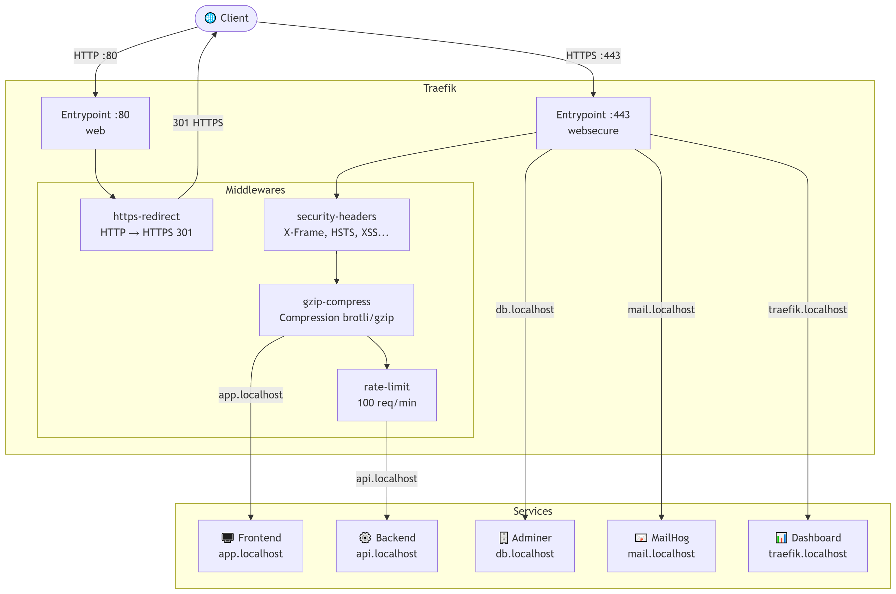
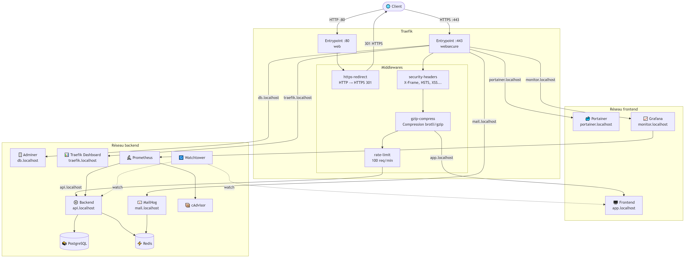

# Architecture Réseau

## 1. Schéma général

### v1.0


### v1.5


---

## 2. Isolation réseau

Le projet utilise deux réseaux Docker distincts pour isoler les services :

### Réseau `frontend`
Contient les services exposés publiquement via Traefik :
- **Traefik** : point d'entrée unique pour tout le trafic entrant
- **Frontend** : serveur nginx qui sert les fichiers statiques
- **Portainer** : interface graphique de gestion des conteneurs Docker
- **Grafana** : interface de visualisation des métriques (exposée via Traefik)

### Réseau `backend`
Contient les services internes, inaccessibles directement depuis l'extérieur :
- **Backend** (x2) : API Node.js
- **PostgreSQL** : base de données relationnelle
- **Redis** : cache et compteur de visites
- **MailHog** : serveur SMTP de développement
- **Adminer** : interface d'administration PostgreSQL
- **Prometheus** : collecte des métriques
- **cAdvisor** : métriques des conteneurs Docker
- **Watchtower** : mise à jour automatique des conteneurs

### Traefik : pont entre les deux réseaux
Traefik est le seul service présent sur les **deux réseaux**. Il reçoit le trafic externe sur le réseau `frontend` et le route vers les services appropriés sur le réseau `backend`. La base de données n'est **jamais** accessible depuis le réseau `frontend`.

### Grafana : pont entre les deux réseaux
Grafana est également présent sur les **deux réseaux** : il collecte ses données depuis Prometheus sur le réseau `backend` et est exposé via Traefik sur le réseau `frontend`.

---

## 3. Fonctionnement de Traefik

Traefik s'articule autour de quatre concepts clés :

### Providers
Le provider **Docker** permet à Traefik de découvrir automatiquement les services via les labels des conteneurs. Le provider **File** charge la configuration statique des middlewares et certificats TLS depuis `traefik/dynamic/`.
```yaml
# traefik.yml
providers:
  docker:
    exposedByDefault: false   # Seuls les conteneurs avec traefik.enable=true sont exposés
  file:
    directory: /dynamic
    watch: true               # Rechargement automatique à chaque modification
```

### Entrypoints
Deux points d'entrée sont définis :
- **web** (`:80`) : reçoit le trafic HTTP et le redirige immédiatement vers HTTPS
- **websecure** (`:443`) : reçoit le trafic HTTPS avec les certificats mkcert

### Routers
Chaque service expose deux routers via ses labels Docker :
- Un router HTTP qui applique le middleware `https-redirect`
- Un router HTTPS qui applique les middlewares de sécurité
```yaml
# Exemple pour le backend
- "traefik.http.routers.backend.rule=Host(`api.localhost`)"
- "traefik.http.routers.backend.entrypoints=web"
- "traefik.http.routers.backend.middlewares=https-redirect@file"
- "traefik.http.routers.backend-secure.rule=Host(`api.localhost`)"
- "traefik.http.routers.backend-secure.entrypoints=websecure"
- "traefik.http.routers.backend-secure.middlewares=security-headers@file,gzip-compress@file,rate-limit@file"
```

### Services
Traefik crée automatiquement un service pour chaque conteneur et gère le **load balancing** entre les replicas. Avec `--scale backend=2`, Traefik distribue le trafic entre les deux instances du backend en round-robin.

### Middlewares
Les middlewares sont définis dans `traefik/dynamic/middlewares.yml` et appliqués via les labels :

| Middleware | Appliqué sur | Rôle |
|---|---|---|
| `https-redirect` | Tous (HTTP) | Redirection 301 vers HTTPS |
| `security-headers` | Frontend + Backend | HSTS, X-Frame-Options, CSP... |
| `gzip-compress` | Frontend + Backend | Compression des réponses |
| `rate-limit` | Backend uniquement | 100 req/min, burst 50 |
| `basic-auth` | Traefik + Adminer | Authentification HTTP Basic |

---

## 4. Justification des choix de sécurité

### HTTPS obligatoire
Tout le trafic HTTP est redirigé vers HTTPS via le middleware `https-redirect`. Les certificats sont générés avec mkcert pour le développement local, garantissant un comportement identique à la production.

### Headers de sécurité
Les headers HTTP de sécurité protègent contre les attaques courantes :
- **HSTS** (`Strict-Transport-Security`) : force le navigateur à utiliser HTTPS
- **X-Frame-Options** (`frameDeny`) : protège contre le clickjacking
- **X-Content-Type-Options** (`nosniff`) : empêche le MIME sniffing
- **Referrer-Policy** : limite les informations envoyées aux sites tiers
- **Permissions-Policy** : désactive les APIs sensibles (caméra, micro, géolocalisation)

### Rate limiting sur l'API
Le rate limiting (100 req/min, burst 50) est appliqué uniquement sur le backend pour protéger l'API contre les abus et les attaques par force brute. Le frontend n'en a pas besoin car il sert des fichiers statiques.

### Basic Auth sur les interfaces d'administration
Le dashboard Traefik et Adminer sont protégés par une authentification HTTP Basic. Ces interfaces exposent des informations sensibles sur l'infrastructure et ne doivent pas être accessibles publiquement.

### Isolation réseau
La base de données PostgreSQL et Redis ne sont accessibles que depuis le réseau `backend`. Même si le frontend était compromis, il ne pourrait pas atteindre directement la base de données.

### Utilisateur non-root
Les conteneurs backend et frontend tournent avec un utilisateur dédié (`appuser`, UID 1001) pour limiter l'impact d'une éventuelle compromission du conteneur.

---

## 5. Docker Swarm (bonus)

### Différences avec Docker Compose

En mode Swarm, l'architecture réseau évolue :

| Concept | Docker Compose | Docker Swarm |
|---|---|---|
| Réseau | `bridge` (une machine) | `overlay` (multi-machines) |
| Secrets | Variables `.env` en clair | Chiffrés dans le Raft store |
| Replicas | `--scale backend=2` | Défini dans `docker-stack.yml` |
| Mise à jour | Redémarrage complet | Zero downtime (rolling update) |

### Réseau overlay

En Swarm, les réseaux `frontend` et `backend` utilisent le driver `overlay` au lieu de `bridge`. Un réseau overlay s'étend sur plusieurs machines physiques — les conteneurs sur des nodes différents peuvent communiquer comme s'ils étaient sur la même machine.

### Docker Secrets

Les secrets remplacent les variables d'environnement en clair. Ils sont :
- **Chiffrés** dans le Raft store de Swarm
- **Montés comme fichiers** dans `/run/secrets/` dans les conteneurs
- **Jamais visibles** dans `docker inspect` ou les logs
```bash
# Création des secrets
echo "devops_password" | docker secret create postgres_password -
echo "devops_user" | docker secret create postgres_user -
echo "devops_db" | docker secret create postgres_db -
echo "discord://TOKEN@CHANNEL_ID" | docker secret create watchtower_notification_url -
```

Le code backend a été adapté pour lire les secrets depuis les fichiers **tout en restant compatible** avec Docker Compose :
```javascript
function readSecret(envVar) {
  const fileVar = process.env[`${envVar}_FILE`];
  if (fileVar) {
    return fs.readFileSync(fileVar, 'utf8').trim(); // Mode Swarm
  }
  return process.env[envVar]; // Mode Compose
}
```

### Placement des services

Certains services sont contraints de tourner sur le **node manager** :

| Service | Contrainte | Raison |
|---|---|---|
| Traefik | `node.role == manager` | Accès au socket Docker |
| PostgreSQL | `node.role == manager` | Volume de données local |
| Redis | `node.role == manager` | Volume de données local |
| Portainer | `node.role == manager` | Accès au socket Docker |
| Prometheus | `node.role == manager` | Volume de métriques local |
| cAdvisor | `node.role == manager` | Volumes système (`/sys`, `/var/lib/docker`) |
| Grafana | `node.role == manager` | Volume de dashboards local |
| Watchtower | `node.role == manager` | Accès au socket Docker |

Les services **stateless** (Backend, Frontend, MailHog, Adminer) peuvent tourner sur n'importe quel node.

### Zero downtime deployment

Le backend est configuré avec une stratégie de rolling update :
```yaml
deploy:
  replicas: 2
  update_config:
    parallelism: 1   # Met à jour 1 replica à la fois
    delay: 10s       # Attend 10s entre chaque mise à jour
```

Lors d'une mise à jour, Swarm met à jour `backend.1`, attend 10s que le service soit healthy, puis met à jour `backend.2`. Le service reste disponible en permanence.
```bash
# Mise à jour sans interruption
docker service update --image devops-foundations-backend:latest --force devops_backend
```

> 💡 **Note avancée** : Dans un vrai cluster multi-nodes, cAdvisor devrait être déployé en mode `global` (un conteneur par node) pour monitorer chaque machine du cluster. La configuration actuelle avec `replicas: 1` est adaptée à un cluster single-node.