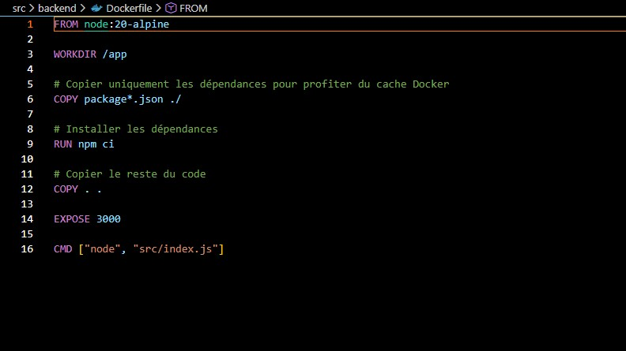
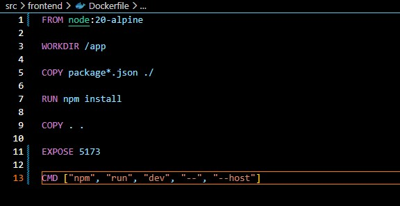
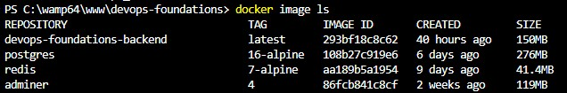
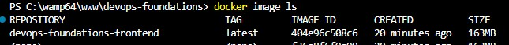
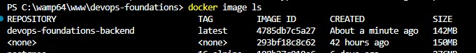
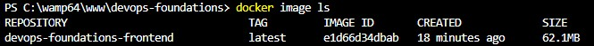

# Comparaison de la taille des images Docker

## Contexte

L'optimisation des images Docker est essentielle pour réduire les temps de build, 
les transferts réseau et la surface d'attaque en production. Ce document compare 
la taille des images avant et après l'introduction du **multi-stage build**.

---

## Avant : images sans multi-stage build

Les Dockerfiles initiaux utilisaient un seul stage basé sur `node:20-alpine`.
Le conteneur embarquait l'intégralité de l'environnement Node.js, les dépendances 
de développement et les outils de build — inutiles en production.

### Backend — Dockerfile initial



### Frontend — Dockerfile initial



### Tailles des images avant optimisation





| Image | Taille avant |
|---|---|
| devops-foundations-backend | 150MB |
| devops-foundations-frontend | 163MB |

---

## Après : images avec multi-stage build

Le multi-stage build sépare la phase de **compilation** de la phase de **production** :

- **Stage builder** : installe les dépendances et compile l'application
- **Stage production** : copie uniquement le résultat final dans une image minimale

### Backend — multi-stage build

```dockerfile
# Stage 1 : installation des dépendances et préparation
FROM node:20-alpine AS builder
WORKDIR /app
COPY package*.json ./
RUN npm ci
COPY . .

# Stage 2 : image de production minimale
# Seul le code applicatif est copié — pas les node_modules de dev
FROM node:20-alpine AS production
WORKDIR /app
COPY --from=builder /app /app
USER appuser
CMD ["node", "src/index.js"]
```

### Frontend — multi-stage build

```dockerfile
# Stage 1 : build de l'application Vite
FROM node:20-alpine AS builder
WORKDIR /app
COPY package*.json ./
RUN npm ci
COPY . .
RUN npm run build

# Stage 2 : image de production nginx
# On remplace Node.js par nginx:alpine — seuls les fichiers statiques sont copiés
FROM nginx:alpine AS production
COPY --from=builder /app/dist /usr/share/nginx/html
```

### Tailles des images après optimisation





| Image | Taille après |
|---|---|
| devops-foundations-backend | 143MB |
| devops-foundations-frontend | 62MB |

---

## Résultats

| Image | Avant | Après | Gain |
|---|---|---|---|
| Backend | 150MB | 143MB | -7MB (-5%) |
| Frontend | 163MB | 62MB | -101MB (-62%) |

### Analyse

**Backend (-5%)** : le gain est modeste car les deux stages utilisent `node:20-alpine`. 
Le multi-stage évite principalement de conserver les devDependencies dans l'image finale, 
mais le runtime Node.js reste nécessaire en production.

**Frontend (-62%)** : le gain est significatif car le stage de production passe de 
`node:20-alpine` (qui embarquait Vite et toutes les dépendances de dev) à `nginx:alpine` 
qui ne contient que les fichiers statiques compilés. Node.js n'est plus nécessaire 
une fois le build effectué.

---

## Conclusion

Le multi-stage build est particulièrement efficace pour les applications frontend où 
le runtime de production (nginx) est radicalement différent de l'environnement de build (Node.js). 
Pour le backend, l'optimisation principale réside dans la séparation des dépendances 
de développement et de production via `npm ci --omit=dev`.